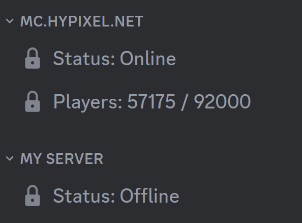
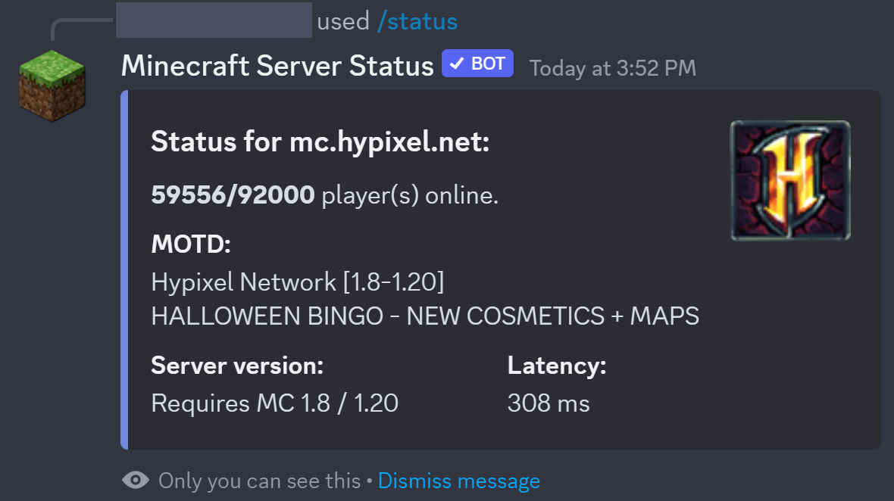

# Minecraft Server Status - Discord Bot

A simple [Discord.js](https://www.npmjs.com/package/discord.js) bot that displays the status of [Minecraft](https://minecraft.gamepedia.com) servers using the
[mcstatus.io](https://mcstatus.io/) library.

**To use:** Simply [invite](https://discord.com/api/oauth2/authorize?client_id=788083161296273517&permissions=269485072&scope=bot%20applications.commands) the
bot to your server.

**Enjoying our bot?** Our bot is completely free to use, and will always remain so. A [donation](https://www.buymeacoffee.com/rahulrao) of any amount helps keep
our server running!

## February 2024 Update

-   New backend log service for better error handling on our end.
-   Minor stability update for most commands.
-   Core package upgrades.
-   Implement transitory code to new backend framework.
-   Various bugfixes.

## Features

-   Auto-updating voice channels to display the server's status and the number of players online
-   Support for both Java and Bedrock servers
-   Support for monitoring multiple Minecraft servers at once
-   Check the status of non-monitored servers
-   Slash command support with ephemeral responses to prevent channels from being cluttered with commands

## Usage

`/status [server|ip] [type]` Displays the current status and active players for any server \
`/monitor ip [nickname] [type]` Create 2 voice channels that display the status of a Minecraft server and optionally set a nickname \
`/nickname nickname [server]` Change the nickname of a monitored Minecraft server \
`/default server` Set a server to be the default for all commands \
`/unmonitor [server|all]` Remove the voice channels for the specified server or all servers \
`/bug` Send a bug report to the developers \
`/help` List the other commands

**Note for Bedrock servers: to use the `/status` and `/monitor` commands, you must set the `type` option to "Bedrock" for the bot to function correctly.**

**Note for Aternos/other hosting users: Underscores are not allowed in Domain names! Please change your server address to remove underscores.**

## Roadmap

### Feature Updates

-   [ ] Rework status, nickname, and unmonitor commands to include dropdown menus
-   [ ] Rework monitor and nickname commands to include modal workflow
-   [ ] Add option to monitor server with message embed instead of voice channels
-   [ ] Link Discord usernames to Minecraft accounts for player list in status command (see [this](https://github.com/dommilosz/minecraft-auth) repository)
-   [ ] Add graph support (see [this](https://github.com/cappig/MC-status-bot) repository)

### Backend Updates

-   [x] Queue priority for non-update commands
-   [x] Minimize redundant channel updates
-   [x] Fix channel permission query
-   [x] Error logging rework
-   [x] Update readme with screenshots
